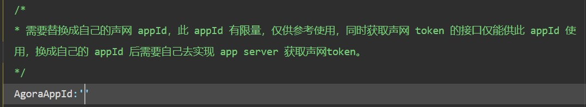
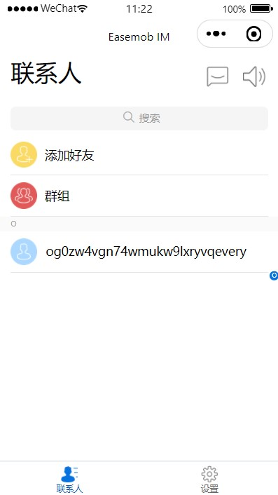

# 介绍

* 源仓库地址：[环信小程序demo](https://github.com/easemob/webim-weixin-xcx)

* 由于在微信小程序开发过程中，需要用到IM服务器，故在此学习（只是用作学习，故将不需要的功能做了删除）

* 代码文件在src中，直接用微信开发者工具打开该文件夹即可。

* 使用前，先要注册环信账号，然后将appid修改（文件为src\utils\WebIMConfig.js）：
  

* 修改后的界面基本如下：

  

  将聊天和通知等功能放在右上角的部分，即将所有的功能集合到一个界面中。

# 各个界面功能注释
```
  "pages": [
    "pages/login/login", //登录界面
    "pages/login_token/login_token", // 通过token登录的界面
    "pages/register/register", // 注册界面

    "pages/index/index", // （可删）就是个欢迎界面吧，类似好多app打开时的哪个广告页面（如果不放在第一个都没法跳转的）
    "pages/guide/guide",  // （可删）指导界面，如果将其放在第一个位置，即小程序打开后的默认目录可以看到，无实际作用

    "pages/chat/chat", // 聊天的主界面
    "pages/chatroom/chatroom", // 进入一个聊天时（使用chat组件，comp中，id为chat（单聊））
    "pages/groupChatRoom/groupChatRoom",  // 进入一个聊天时（使用chat组件，comp中，id为groupchat（群聊））
    "pages/emediaInvite/emediaInvite", // （可删）音视频会议（在组件中可以查看是否打开设置）
    
    "pages/main/main", // 联系人主界面（tab）
    "pages/add_new/add_new", // 添加好友
    "pages/groups/groups", // 群组信息
    "pages/groupSetting/groupSetting", // 在群名片最后的按钮可以修改群信息（解散群组等等，根据权限不同，功能不同）
    "pages/add_groups/add_groups", // 添加群组

    "pages/notification/notification", // 通知界面
    "pages/notification_groupDetail/groupDetail", // 组通知
    "pages/notification_friendDetail/friendDetail", // 好友通知
    "pages/inform/inform", // （可删）被注释掉了，在main界面存在申请与通知的按钮，但是现在不用了，就是展示了好友申请，跟通知栏功能冲突或者说是将功能移动到了tab中

    "pages/setting/setting", // tab中的设置
    "pages/setting_general/setting_general", // 总的小程序设置（但是好多都注释掉了）
    "pages/emediaSetting/emediaSetting" // 关于实时音视频的设置
  ]
```

# 
